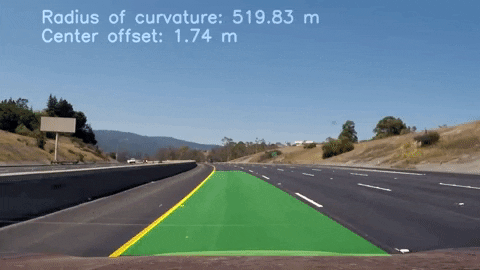

## Advanced Lane Finding
### In this project, the goal is to write a software pipeline to identify the lane boundaries in a video

# Navigation 
[camera_cal/](https://github.com/DavidSilveraGabriel/Self_driving_car_UdacityND/tree/master/P2/CarND-Advanced-Lane-Lines-master/camera_cal)  Directory with calibration images

[output_images/](https://github.com/DavidSilveraGabriel/Self_driving_car_UdacityND/tree/master/P2/CarND-Advanced-Lane-Lines-master/output_images) 

[test_images/](https://github.com/DavidSilveraGabriel/Self_driving_car_UdacityND/tree/master/P2/CarND-Advanced-Lane-Lines-master/test_images)

Main notebook 
---

The goals / steps of this project are the following:

* The camera calibration 
* Apply a distortion correction to raw images.
* Create a thresholded binary image.
* Apply a perspective transform ("birds-eye view").
* Detect lane pixels 

### Pipeline

* Determine the curvature and vehicle position with respect to center.
* Draw in the image the detected lines
* Output visual display

The images for camera calibration are stored in the folder called `camera_cal/`.  The images in `test_images/` are for testing the pipeline on single frames. 

The `challenge_video.mp4` video is an extra (and optional) challenge 
The `harder_challenge.mp4` video is another optional challenge and is brutal!

