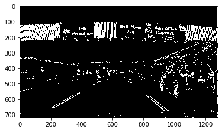
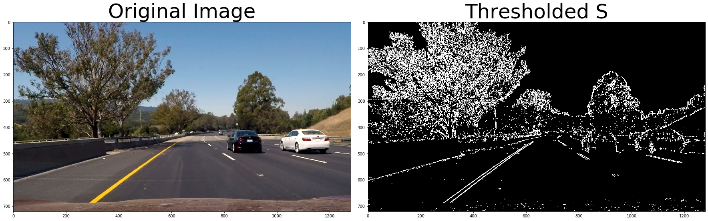
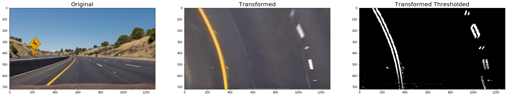
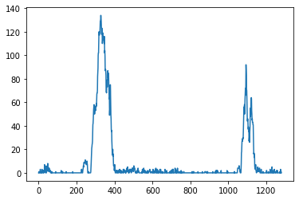
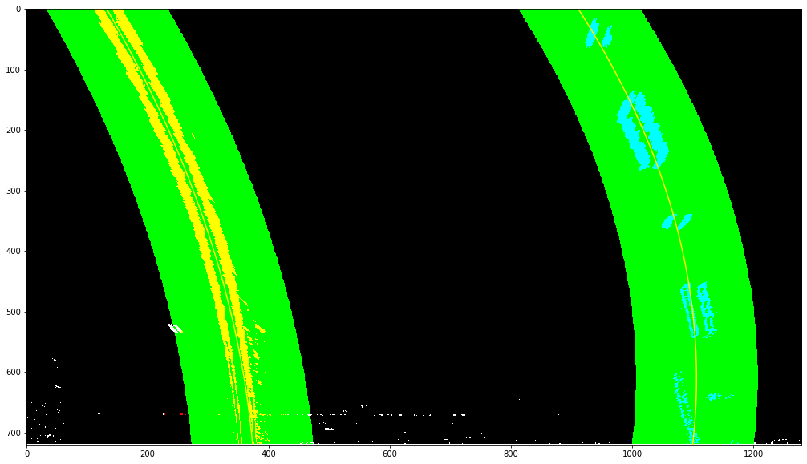

## Advanced Lane Finding
### In this project, the goal is to write a software pipeline to identify the lane boundaries in a video


# Navigation 
[camera_cal/](https://github.com/DavidSilveraGabriel/Self_driving_car_UdacityND/tree/master/P2/CarND-Advanced-Lane-Lines-master/camera_cal)  Directory with calibration images

[output_images/](https://github.com/DavidSilveraGabriel/Self_driving_car_UdacityND/tree/master/P2/CarND-Advanced-Lane-Lines-master/output_images) Directory with output images

[test_images/](https://github.com/DavidSilveraGabriel/Self_driving_car_UdacityND/tree/master/P2/CarND-Advanced-Lane-Lines-master/test_images) Directory of images used to test the code

[Examples/](https://github.com/DavidSilveraGabriel/Self_driving_car_UdacityND/tree/master/P2/CarND-Advanced-Lane-Lines-master/examples) Directory with examples of images and code


Main notebook 
---

Steps of this project are the following:

* The camera calibration 
* Apply a distortion correction to raw images.
* Create a thresholded binary image.
* Apply a perspective transform ("birds-eye view").
* Detect lane pixels 

### Pipeline

* Determine the curvature and vehicle position with respect to center.
* Draw in the image the detected lines
* Output visual display

The images for camera calibration are stored in the folder called `camera_cal/`.  The images in `test_images/` are for testing the pipeline on single frames. 

The `challenge_video.mp4` video is an extra (and optional) challenge 
The `harder_challenge.mp4` video is another optional challenge and is brutal!

# Step by step development

## The camera calibration 
Calibrate the camera to correct for image distortions. For this we use a set of chessboard images, knowing the distance and angles between common features like corners, we can calculate the tranformation functions and apply them to the video frames.

- Define corners and the arrays to store object points and image points from all the images.
```python
nx = 9 # number of corners in x direction
ny = 6 # number of corners in Y direction
##################
objpoints = [] # 3d points in real world space
imgpoints = [] # 2d points in image plane.
```
- Prepare grid and points to display
```python
objp = np.zeros((np.prod(nx*ny),3),dtype=np.float32)
objp[:,:2] = np.mgrid[0:ny, 0:nx].T.reshape(-1,2)
```
- Make a list of calibration images
```python
images = glob.glob('camera_cal/calibration*.jpg')
```

- Step through the list and search for chessboard corners
```python
   for fname in images:
      img = cv2.imread(fname)
      # Converting an image, imported by cv2 or the glob API, to grayscale
      gray = cv2.cvtColor(img,cv2.COLOR_BGR2GRAY)

      # Find the chessboard corners
      ret, corners = cv2.findChessboardCorners(gray, (nx,ny),None)

      # If found, add object points, image points
      if ret == True:
          objpoints.append(objp) #<--- the important we will use later:D 
          imgpoints.append(corners) #<--- the important we will use later:D
```

- send that objpoints and imgpoints to the cv2 function 
```python
def cal_undistort(img, objpoints, imgpoints):
    # calibrate camera 
    ret, mtx, dist, rvecs, tvecs = cv2.calibrateCamera(objpoints, imgpoints, img.shape[0:2], None, None)
    
    # Undistorting the image
    undist = cv2.undistort(img, mtx, dist, None, mtx)
        
    return undist
```

# Apply a distortion correction to raw images. 

here we apply the distortion correction in the images, here the results in two images
the first is the dash:


the second a road image:


# Create a thresholded binary image. 

here we use the combination of 3 algorithms seen during the classes ```-->abs_sobel_thresh, mag_thresh and dir_threshold``` 



Apply each of the thresholding functions and combining results



# Apply a perspective transform ("birds-eye view").

here we can divide it into 9 steps
1 define points borders 
```python
    top_right = (723, 453)
    top_left = (556, 456)
    botom_right = (1285, 685)
    botom_left = (0, 680)
``` 
2 extract image dimensions
```python
img_size = (img.shape[1], img.shape[0])
``` 
3 set source points
```python
src = np.float32([[top_right],[top_left],[botom_right],[botom_left]])
``` 
4 define width and height
```python
w, h = img.shape[1], img.shape[0]
``` 
5 set destination points
```python
dst = np.float32([[w,0],[0,0],[w,h],[0,h]])
``` 
6 get a perspective transform matrix
```python
M = cv2.getPerspectiveTransform(src, dst)
``` 
7 get inverse matrix
```python
unwrap_m = cv2.getPerspectiveTransform(dst, src)
``` 
8 warp original image
```python
warped = cv2.warpPerspective(image, M, img_size, flags=cv2.INTER_LINEAR)
``` 
9 Return the resulting image 




# Detect lane pixels 

Now by using the transformed image, identify the lane line pixels. To accomplish this we'll use a method called "Peaks in a Histogram" where we analyse the histogram of section of the image, window, and identify the peaks which represent the location of the lane lines.



basicamente para esta parte hice 2 funciones 
```fit_ poly ()```: Fit a polynomial to all the relevant pixels you've found in your sliding windows
```search_around_poly()```: Set the area to search for activated pixels

for more detail look in : [Main.ipynb](https://github.com/DavidSilveraGabriel/Self_driving_car_UdacityND/blob/master/P2/CarND-Advanced-Lane-Lines-master/Main%20.ipynb)

# pipeline 

Finnaly we got to the pipeline !!! 
we could divide it into 3 parts
### The first part consists of 3 functions and pieces of recycled code from the step of detecting lines
- cal_undistort -> the function corresponds to the calibration part of the camera
- perspective_transform -> we saw this function in the step ("birds-eye view")
- combined -> and this is the function that creates thresholded binary image
### The second part consist in determine the curvature and vehicle position with respect to center.
For more detail go to: [Main.ipynb](https://github.com/DavidSilveraGabriel/Self_driving_car_UdacityND/blob/master/P2/CarND-Advanced-Lane-Lines-master/Main%20.ipynb)

### The last part consist in draw in the image the detected lines


# Output visual display in a video

And in the end here the result :D !!! 


